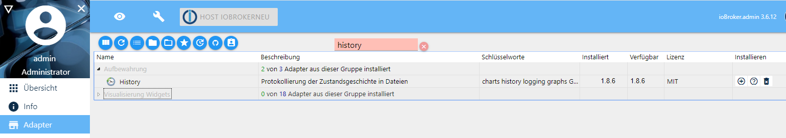
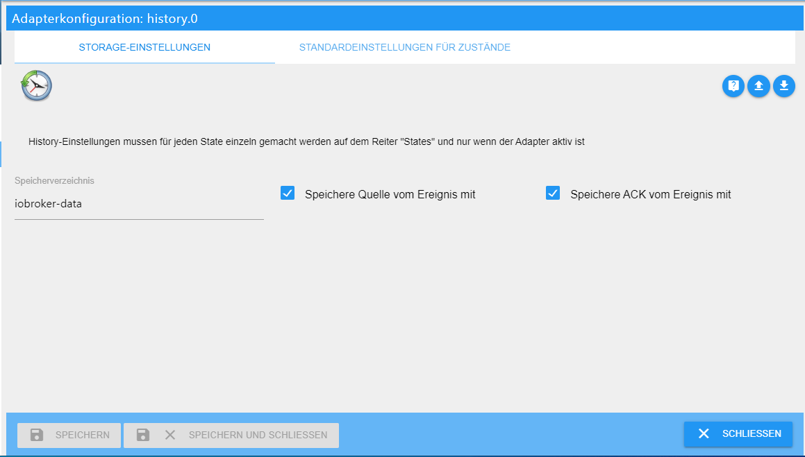
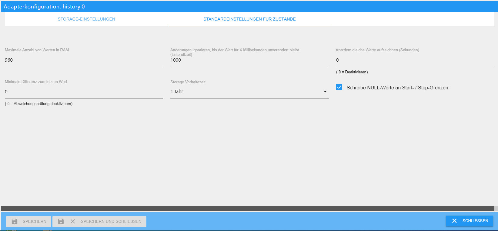
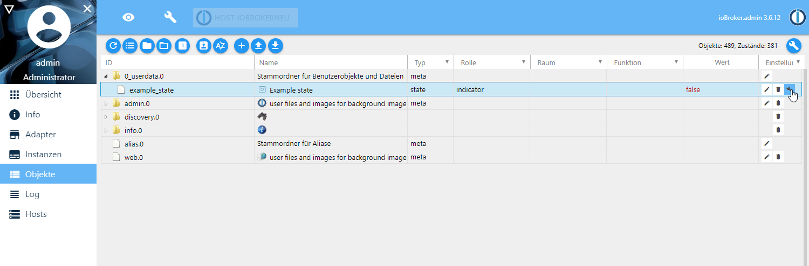
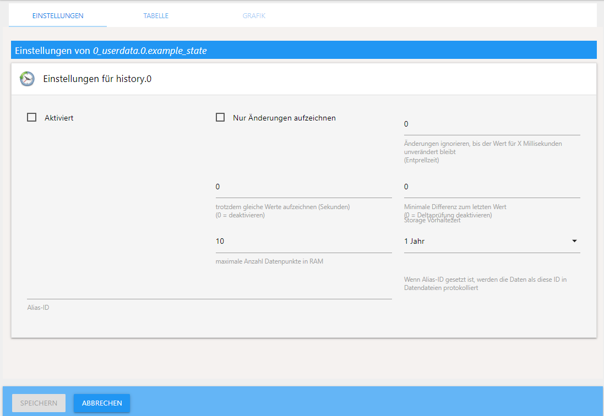
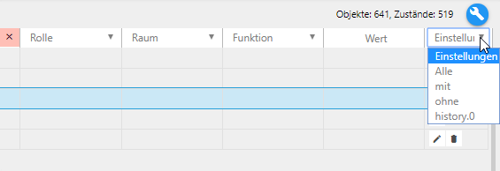
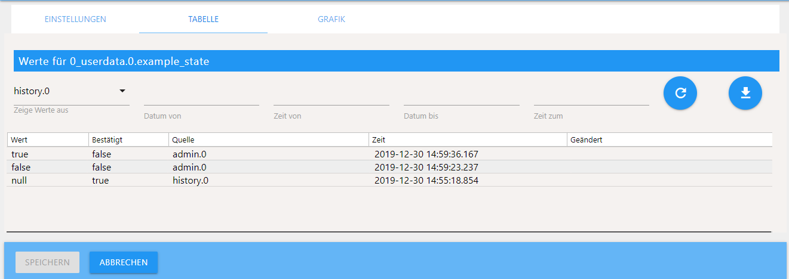
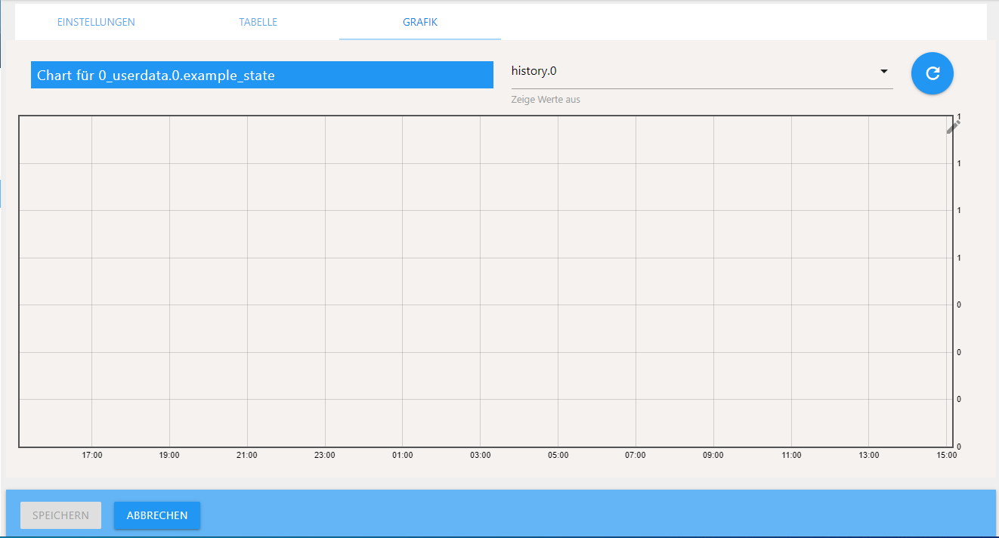
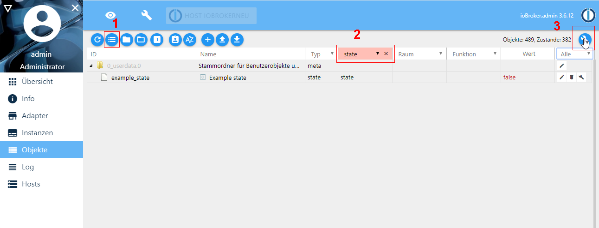
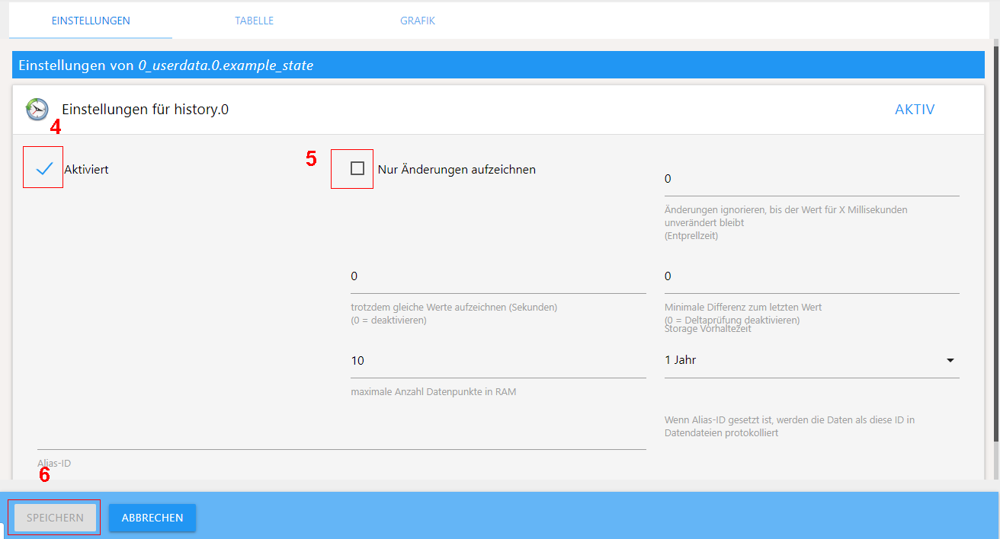

# ioBroker History-Adapter

# Inhalt
* [Beschreibung](#beschreibung)
* [Installation](#installation)
* [Konfiguration](#konfiguration)
	* [Storage-Einstellungen](#storage-einstellungen)
	* [Standardeinstellungen für Zustände](#standardeinstellungen-für-zustände)
	* [Einstellungen für Datenpunkte](#einstellungen-für-datenpunkte)
* [Bedienung](#bedienung)
	* [Filtern](#filtern)
	* [Werte anzeigen](#werte-anzeigen)
	* [Grafiken](#grafiken)
	* [Mehrere Datenpunkte auf einmal loggen](#mehrere-datenpunkte-auf-einmal-loggen)
* [Zugriff auf History Werte mit JavaScript](#zugriff-auf-history-werte-mit-javascript)
* [Verlaufsprotokollierung über JavaScript](#verlaufsprotokollierung-über-javascript)
* [History-Daten in SQL oder InfluxDB übernehmen](#history-daten-in-sql-oder-influxdb-übernehmen)


## Beschreibung
Der history-Adapter dient zum loggen von Datenpunkten. Deren Statusverlauf im
JSON Format in zwei Schritten gespeichert wird: Zuerst werden die Werte im RAM
zwischengespeichert und anschließend beim Erreichen der maximalen Anzahl von
Werten im RAM in das ausgewählte Speicherverzeichnis geschrieben.

## Installation
Eine Instanz des History-Adapters wird über die ioBroker Admin-Oberfläche mit klicken
auf das + Zeichen installiert.



Nach der Erstellung der Instanz öffnet sich das Konfigurationsfenster.

## Konfiguration

### Storage-Einstellungen



**Speicherverzeichnis**
Hier den Ordnernamen eingeben, in dem die Dateien gespeichert werden sollen.  
Der Ordner wird im Standardverzeichnis ```/opt/iobroker/iobroker-data``` angelegt.  
In diesem Ordner wird jeden Tag ein neuer Unterordner erstellt in dem die geloggten 
Daten gespeichert werden.

> Ohne Angabe eines Speicherverzeichnisses wird der Ordner 
> ```/opt/iobroker/iobroker-data/history``` automatisch angelegt  


> Absolute Verzeichnisse wie z.B.: /mnt/history (Linux) oder D:/history (Windows) können
ebenso eingegeben werden. 

**Speichere Quelle vom Ereignis mit**
Legt fest ob die Quelle der Datenänderung (der auslösende Adapter) mit gespeichert
werden soll.

**Speichere Ack vom Ereignis mit**
Legt fest ob das “Ack-Flag” mit gespeichert werden soll.

### Standardeinstellungen für Zustände
Hiermit werden Voreinstellungen für die zu überwachenden Datenpunkte festgelegt.
Jeder Wert kann im Datenpunkt selbst nachträglich geändert werden.



**Maximale Anzahl von Werten im RAM**
Nach dem Erreichen dieser Anzahl werden die Werte vom RAM ins Speicherverzeichnis
geschoben. Besonders bei Systemen mit SD-Karte kann ein hoher Wert die Lebensdauer
der SD-Karte erhöhen.

**Änderungen ignorieren, bis der Wert für X Millisekunden unverändert bleibt (Entprellzeit)**
Dies ist der Mindestabstand in Millisekunden bis wieder ein Wert geschrieben
wird und dient zum Schutz vor zu häufigen Änderungen eines Wertes.

**trotzdem gleiche Werte aufzeichnen (Sekunden)**
sollen bei gleichem Wert von Zeit zu Zeit trotzdem diese (unveränderten) Werte
gespeichert werden, kann hier eine Zeitspanne in Sekunden festgelegt werden,
wie häufig dieses geschehen soll. Dementsprechend bedeutet die Eingabe 0, dass
kein doppelter Wert gespeichert werden soll.

**Minimale Differenz zum letzten Wert**
sollen bei ständig wechselnden Werten trotzdem diese (geänderten) Werte nicht
gespeichert werden, kann hier ein Mindestwert festgelegt werden, den sich der Wert
ändern muss, damit wieder ein neuer Wert gespeichert wird. Dies ist beispielsweise
bei Strommesssteckdosen sinnvoll, bei dem nicht jede leichte Veränderung geloggt
werden soll. Dementsprechend bedeutet die Eingabe 0, dass jeder Wert gespeichert
werden soll.

**Storage Vorhaltezeit**
Legt fest, wie lange die Werte gespeichert werden sollen, nach der eingestellten
Zeit werden sie gelöscht (keine automatische Löschung, 2 Jahre, 1 Jahre, …, 1 Tag).

**Schreibe NULL-Werte an Start-Stop-Grenzen**
??


## Einstellungen für Datenpunkte
Die Einstellungen für den zu loggenden Datenpunkt werden in dem Reiter „Objekte“
bei dem entsprechenden Datenpunkt in der Spalte rechts über das Schraubenschlüsselsymbol durchgeführt.


Das Konfigurationsmenü öffnet sich:



**Aktiviert**
Logging des Datenpunktes aktivieren

**Nur Änderungen aufzeichnen**
Es werden nur Werte gespeichert, wenn sich der Wert des Datenpunktes ändert und
spart somit Speicherplatz. Alle weiteren Einstellungen sind gemäß den Standard-
einstellungen für Zustände voreingestellt und können hier nochmals angepasst werden.

**Alias-ID**
Wenn angeben, werden z.B. nachdem ein Geräte- oder Datenpunktnamen geändert wurde,
die Daten immer noch mit der alten ID protokolliert.


## Bedienung
### Filtern
Wird unter Objekte in der Titelzeile rechts unter Einstellungen “mit” oder
"history.0" ausgewählt, werden nur noch Datenpunkte angezeigt, für die das
Logging aktiv ist:



### Werte anzeigen
Ein Klick auf das Schraubenschlüsselsymbol im Datenpunkt des Objektes öffnet die
Einstellungen erneut und unter Tabelle erscheinen die bereits geloggten Daten:



Mit dem runden Pfeilsymbol können die Daten aktualisiert werden und mit dem Pfeil
nach unten Symbol die geloggten Daten als csv-Datei heruntergeladen werden.

### Grafiken
Bei installiertem flot oder Rickshaw Adapter wird im Reiter Grafik der grafische
verlauf angezeigt:



### Mehrere Datenpunkte auf einmal loggen
Um mehrere Datenpunkte auf einmal zu loggen, lassen sich über Filterfelder in der
Titelzeile die Datenpunkte so filtern, dass man z.B. nur die „State“ Datenpunkte
herausfiltert, um sie dann gemeinsam alle zu loggen.

>Vorsicht: Bei großen Installationen kann es viele tausend Datenpunkte vom Typ State
geben und das erstellen dauert entsprechend lange. Das beschriebene Vorgehen dient
nur als Beispiel!


1. Hierzu die Ansicht der Objekte in Listenansicht ändern
2. den Filterbegriff state in der Spalte Typ auswählen
3. Den Gabelschlüssel rechts oben anklicken und das Konfigurationsmenü für die
Einstellungen der log-Parameter öffnet sich
**
4. Das loggen für alle gefilterten Datenpunkte auf einmal aktivieren
5. Weitere Parameter wie „nur Änderungen“ und Vorhaltezeit für alle gefilterten
Datenpunkte einheitlich auswählen
6. Die Änderungen speichern


## Zugriff auf History Werte mit JavaScript
Mit installiertem JavaScript-Adapter kann auf die sortierten Werte des Adapters
zugegriffen werden. Beispiele:

- Die 50 zuletzt gespeicherte Ereignisse für alle IDs holen:
```
sendTo('history.0', 'getHistory', {
    id: '*',
    options: {
        end:       Date.now(),
        count:     50,
        aggregate: 'onchange'
    }
}, function (result) {
    for (var i = 0; i < result.result.length; i++) {
        console.log(result.result[i].id + ' ' + new Date(result.result[i].ts).toISOString());
    }
});
```

- Abrufen der in der letzten Stunde gespeicherten Werte für Datenpunkt
"system.adapter.admin.0.memRss"
```
var end = Date.now();
sendTo('history.0', 'getHistory', {
    id: 'system.adapter.admin.0.memRss',
    options: {
        start:      end - 3600000,
        end:        end,
        aggregate: 'onchange'
    }
}, function (result) {
    for (var i = 0; i < result.result.length; i++) {
        console.log(result.result[i].val + ' ' + new Date(result.result[i].ts).toISOString());
    }
});
```

Mögliche Einstellungen:
- **start** - (Optional) Zeit in ms - *Date.now()*'
- **end** - (Optional) Zeit in ms - *Date.now()*', Standarwert
 (jetzt + 5.000 s)
- **step** - (Optional) Nutzung bei Aggregation (m4, max, min, average, total)
 Schritte in ms Intervall
- **count** - Anzahl der Werte, wenn das Aggregat 'onchange' ist, oder wenn eine
 andere Aggregatmethode verwendet wird Anzahl der Intervalle. Count wird ignoriert,
 wenn **step** gesetzt ist, sonst ist der Default-Wert 500 wenn count nicht angegeben.
- **from** - wenn *from* Feld in Antwort enthalten sein soll
- **ack** - wenn *ack* Feld in Antwort enthalten sein soll
- **q** - wenn *q* Feld in Antwort enthalten sein soll
- **addId** - wenn *id* Feld in Antwort enthalten sein soll
- **limit** - limitiert die Anzahl der zurückgegebenen Einträge
- **ignoreNull** - wenn Nullwerte enthalten sein sollen (false), ersetzt durch den
  letzten Nicht-Nullwert (true) oder ersetzt durch 0 (0)
- **aggregate** - Aggregations Methoden:
    - *minmax* - verwendet speziellen Algorithmus. Verbindet den gesamten
     Zeitbereich in kleinen Intervallen und finde für jedes Intervall Max-, Min-,
     Start- und Endwerte.
    - *max* - Verbinde den gesamten Zeitbereich in kleinen Intervallen und finde
     für jedes Intervall den Maximalwert und verwende ihn für dieses Intervall
     (Nullen werden ignoriert).
    - *min* - Wie max, aber mit minimalem Wert.
    - *average* - Wie max, aber mit Durchschnittswert
    - *total* - Wie max, aber Gesamtwert wird berechnet.
    - *count* - Entspricht max, berechnet aber die Anzahl der Werte (Nullen werden berechnet).
    - *none* - Überhaupt keine Aggregation. Nur Rohwerte im angegebenen Zeitraum.

Der erste und der letzte Punkt werden für Aggregationen berechnet, mit Ausnahme
der Aggregation **none**. Bei manueller Anforderung einer Aggregation, sollten der
erste und letzte Wert ignoriert werden, da diese aus Werten außerhalb des Zeitraums
berechnet werden.

### storeState
Sollen andere Daten in z.B. eine InfluxDB geschrieben werden, kann die eingebaute
Systemfunktion **storeState** verwendet werden. Diese Funktion kann auch zum
Konvertieren von Daten aus anderen Verlaufsadaptern wie dem SQL-Adapter verwendet
werden.

Die angegebenen IDs werden nicht mit der ioBroker-Datenbank abgeglichen und müssen
dort nicht eingerichtet werden, sondern sind nur direkt zugänglich.

Die Nachricht kann eines der folgenden drei Formate haben:
- eine ID und ein Objektstatus
- eine ID und ein Array von Objektstatus
- Array von mehreren IDs mit Objektstatus

## Verlaufsprotokollierung über JavaScript
Der Adapter unterstützt das Aktivieren/Deaktivieren der Verlaufsprotokollierung
über JavaScript sowie das Abrufen der Liste der aktivierten Datenpunkte mit
ihren Einstellungen.

### Aktivieren
Es wird die "ID" des Datenpunkts benötigt und optional "options" zum Definieren
von Datenpunkt-spezifischen Einstellungen:

```
sendTo('history.0', 'enableHistory', {
    id: 'system.adapter.history.0.memRss',
    options: {
        changesOnly:  true,
        debounce:     0,
        retention:    31536000,
        maxLength:    3,
        changesMinDelta: 0.5,
        aliasId: ''
    }
}, function (result) {
    if (result.error) {
        console.log(result.error);
    }
    if (result.success) {
        //successfull enabled
    }
});
```

### Deaktivieren
Es wird die "ID" des Datenpunkts benötigt.

```
sendTo('history.0', 'disableHistory', {
    id: 'system.adapter.history.0.memRss',
}, function (result) {
    if (result.error) {
        console.log(result.error);
    }
    if (result.success) {
        //successfull enabled
    }
});
```

### Liste aktivierter Datenpunkte aufrufen
Es werden keine Parameter benötigt.

```
sendTo('history.0', 'getEnabledDPs', {}, function (result) {
    //result is object like:
    {
        "system.adapter.history.0.memRss": {
            "changesOnly":true,
            "debounce":0,
            "retention":31536000,
            "maxLength":3,
            "changesMinDelta":0.5,
            "enabled":true,
            "changesRelogInterval":0,
            "aliasId": ""
        }
    }
});
```

## History-Daten in SQL oder InfluxDB übernehmen

Wenn im Laufe der Zeit viele Daten anfallen, ist der History-Adapter möglicherweise
nicht die beste Wahl und es wäre besser eine echte Datenbank zu nutzen. Da es ioBroker-
Adapter für SQL-Datenbanken wie PostgreSQL, MS-SQL, MySQL, SQLite und für InfluxDB
gibt, wäre es sinnvoll bereits gesammelte Daten des History-Adapters in die neue
Zieldatenbank übernehmen zu können.

Diese Aufgabe wird von Skripts im Linux Verzeichnis ```/opt/iobroker/node_modules/iobroker.history/converter```
erledigt. Die Ausführung erfolgt dort über die Kommandozeile mit vorangesetzten
Befehl nodejs.

### Schritt 1: Aufbereiten und analysieren von vorhandenen Daten
Beim Konvertieren von Daten sollten nur die Daten übertragen werden, die noch nicht
in der Zieldatenbank vorhanden sind. Dafür werden je nach gewünschter Zieldatenbank
die Skripte **analyzeinflux.js** oder **analyzesql.js** genutzt. Hiermit wird zu
Beginn einer Datenübernahme geprüft, welche Daten bereits vorhanden sind, um diese
lokal in .json Dateien zu speichern. Die .json Dateien werden dann vom eigentlichen
Konverter **history2db.js** Skript verwendet.
Folgende .json Dateien werden erstellt:

- **frühester Wert für Datenpunkt-ID** Der Zeitstempel des allerersten Eintrags für
 jeden vorhandenen Datenpunkt wird gespeichert und beim Importieren verwendet,
 um standardmäßig alle neueren Werte zu ignorieren. Es wird davon ausgegangen,
 dass die Daten ab diesem ersten Eintrag vollständig ausgefüllt sind und alle früheren
 Werte ansonsten dupliziert würden. Diese Annahme kann beim Import durch Parameter
 überschrieben werden.

- **vorhandene Werte pro Tag pro Datenpunkt-ID** Die vorhandenen Daten werden pro Tag
 analysiert und an jedem Tag, an dem bereits Daten vorhanden sind, gespeichert. Dies
 kann alternativ zu den ersten Daten verwendet werden, um auch "Löcher" in die Daten
 füllen zu können.

### analyzeinflux.js
Dieses Skript sammelt die oben genannten Daten für eine InfluxDB-Instanz.

**Verwendung**: nodejs analyzeinflux.js [InfluxDB-Instanz] [Loglevel] [--deepAnalyze]

**Beispiel**: nodejs analyzeinflux.js influxdb.0 info --deepAnalyze

Parameter:
- Welche InfluxDB-Instanz soll verwendet werden?
(Standard: influxdb.0) Wenn benutzt, muss dies der erste Parameter nach dem
Skriptnamen sein.
- Loglevel für die Ausgabe (Standard: info). Wenn gesetzt, muss dies der
zweite Parameter nach dem Skriptnamen sein.
- --deepAnalyze: sammelt auch die vorhandenen Werte pro Tag, standardmäßig wird
nur der früheste Wert abgefragt.

Das Skript generiert dann eine oder drei .json-Dateien mit den gesammelten Daten.
Diese Dateien werden dann vom eigentlichen Konverter Skript verwendet.

### analyzesql.js
Dieses Skript sammelt Teile der oben genannten Daten für eine SQL-Instanz.

**Verwendung**: nodejs analyzesql.js [SQL-Instanz] [Loglevel]

**Beispiel**: nodejs analyzesql.js sql.0 info

Parameter:
- Welche SQL-Adapter-Instanz soll verwendet werden?
(Standard: sql.0) Wenn benutzt, muss dies der erste Parameter nach dem
Skriptnamen sein.
- Loglevel für die Ausgabe (Standard: info). Wenn gesetzt, muss dies der
zweite Parameter nach dem Skriptnamen sein.

Das Skript generiert dann zwei .json-Dateien mit den gesammelten Daten. Diese
Dateien werden dann vom eigentlichen Konverter Skript verwendet.

### Schritt 2: History-Daten konvertieren
Das Skript **history2db.js** verwendet die in Schritt 1 generierten .json Dateien
um sie in die Zieldatenbank zu konvertieren. Dabei werden die generierten Dateien
untersucht um nur nicht bereits vorhandene Daten zu konvertieren.

Das Skript kann auch ohne vorherigen Analyseschritt 1 ausgeführt werden. Dann müssen
jedoch die Startdaten [Date-to-start] als Parameter festgelegt werden und alle vor
diesem Zeitpunkt liegende Daten werden konvertiert.

Wenn zuvor eine Analyse ausgeführt wurde und die Datei **earliestDBValues.json**
vorhanden ist, werden nur diese Datenpunkte konvertiert, außer es werden Parameter
verwendet, um dies abzuändern.

Wenn zuvor eine Analyse ausgeführt wurde und die Datendateien wurden verwendet,
werden diese auch mit allen konvertierten Daten aktualisiert, sodass bei einer
zweiten Ausführung normalerweise keine Duplikate generiert werden sollten. Um die
Daten zurückzusetzen, sind die Dateien **earliestDBValues.json**, **existingDBValues.json**
und/oder **existingDBTypes.json** zu löschen.

Der Konverter durchläuft dann alle als Daten verfügbaren Tage in der Zeit rückwärts und
bestimmt, welche Daten an InfluxDB übertragen werden sollen.

>Der Vorgang kann mit "x" oder "Strg-c" abgebrochen werden.

Das Konverter Skript selbst sollte mit allen Verlaufs-Adaptern funktionieren, die
**storeState** Methoden unterstützen.

>Hinweis: Die Migration vieler Daten führt zu einer bestimmten Systemlast, insbesondere
>wenn Konverter und Zieldatenbankinstanz auf demselben Computer ausgeführt werden.
>Die Auslastung und Leistung des Systems während der Aktion sollte überwacht werden
>und möglicherweise der Parameter [delayMultiplicator] verwendet werden, um ein
>verzögertes Abarbeiten der Daten zu nutzen.

**Verwendung:**
nodejs history2db.js [DB-Instanz] [Loglevel] [Date-to-start|0] [path-to-Data] [delayMultiplicator] [--logChangesOnly [relog-Interval(m)]] [--ignoreExistingDBValues] [--processNonExistingValuesOnly] [--processAllDPs] [--simulate]

**Beispiel**:
nodejs history2db.js influxdb.0 info 20161001 /path/to/data 2 --logChangesOnly 30 --processNonExistingValuesOnly

Mögliche Optionen und Parameter:

- **DB-Instanz**: Instanz an die die Daten gesendet werden. Erforderlicher Parameter.
 Muss direkt nach dem Skriptnamen angegeben werden sein.
- **Loglevel**: Loglevel für die Ausgabe (Default: info).
 Wenn gesetzt, muss dies der zweite Parameter nach dem Skriptnamen stehen.
- **Date-to-start**: Startdatum im Format yyyymmdd (z. B. 20191028).
 "0" verwenden um erkannte früheste Werte zu verwenden. Wenn gesetzt, muss dies der dritte
 Parameter nach dem Skriptnamen sein.
- **path-to-Data** Pfad zu den Datendateien.
Standard iobroker-Installationsverzeichnis: /iobroker-data/history-data.
Wenn gesetzt, muss dies der vierte Parameter nach dem Skriptnamen sein.
- **delayMultiplicator**: Ändert die Verzögerungen zwischen den Aktionen im Skript durch einen
 Multiplikator. "2" würde bedeuten, dass sich die Verzögerungen verdoppeln, die der Konverter
 berechnet hat. Wenn gesetzt, muss dies der fünfte Parameter nach dem Skriptnamen sein.
- **--logChangesOnly [relog-Interval (m)]** Wenn gesetzt, werden die Daten analysiert und reduziert,
 so dass nur geänderte Werte in InfluxDB gespeichert werden. Zusätzlich kann ein "relog-Interval"
 in Minuten eingestellt werden, um unveränderte Werte nach diesem Intervall neu zu protokollieren.
- **--ignoreExistingDBValues**: Mit diesem Parameter werden bereits vorhandene Daten ignoriert und
 alle Daten in den DB eingefügt. Bitte sicherstellen, dass keine Duplikate generiert werden.
 Diese Option ist nützlich, um unvollständige Daten zu vervollständigen.
 Standardmäßig werden nur alle Datenpunkte mit mindestens einem Eintrag in der Datenbank gefüllt.
 Dies kann von **--processAllDPs** überschrieben werden
- **--processNonExistingValuesOnly**: Mit diesem Parameter wird die Datei **existingDBValues.json**
 aus dem Analyseskript verwendet und für jeden Tag und Datenpunkt geprüft.
 In diesem Modus werden die vorhandenen Werte in der DB immer ignoriert und auch nicht aktualisiert.
 >Nach Verwendung dieses Modus bitte einen weiteren Analyselauf durchführen!!!
- **--processAllDPs** Mit diesem Parameter wird sicher gestellt, dass alle vorhandenen Datenpunkte aus
 den History-Dateien in die DB übertragen werden, auch wenn diese in der DB noch nicht vorhanden sind.
- **--simulate**: Aktiviert den Simulationsmodus, d.h. es findet kein richtiges Schreiben statt und auch die
 Analysedatendateien werden beim Beenden nicht aktualisiert.

### Empfohlene Vorgehensweise bei der Migration
Zur Migration wird folgender Ablauf empfohlen:

* Zuerst die neue Logging Methode aktivieren und alle States richtig konfigurieren. Prüfen das alle Werte ankommen wie geplant. Logging erfolgt "deoppelt" (also in History und im neuen)
* Dann Analyse-Skripte laufen lassen um den exakten Beriech zu ermittlen der Migriert werden soll.
* Dann History Adapter stoppen un die Migration ausführen. Dies kann etwas dauern. Die alten Werte werden hinzugefügt.
* Dan wenn alles passt und die Logfiles ausgewertet sind History Daten löschen und Adapter deaktivieren.

### Empfohlene Vorgehensweise bei der Migration
Zur Migration wird folgender Ablauf empfohlen:

* Zuerst die neue Logging Methode aktivieren und alle States richtig konfigurieren. Prüfen das alle Werte ankommen wie geplant. Logging erfolgt "deoppelt" (also in History und im neuen)
* Dann Analyse-Skripte laufen lassen um den exakten Beriech zu ermittlen der Migriert werden soll.
* Dann History Adapter stoppen un die Migration ausführen. Dies kann etwas dauern. Die alten Werte werden hinzugefügt.
* Dan wenn alles passt und die Logfiles ausgewertet sind History Daten löschen und Adapter deaktivieren.
