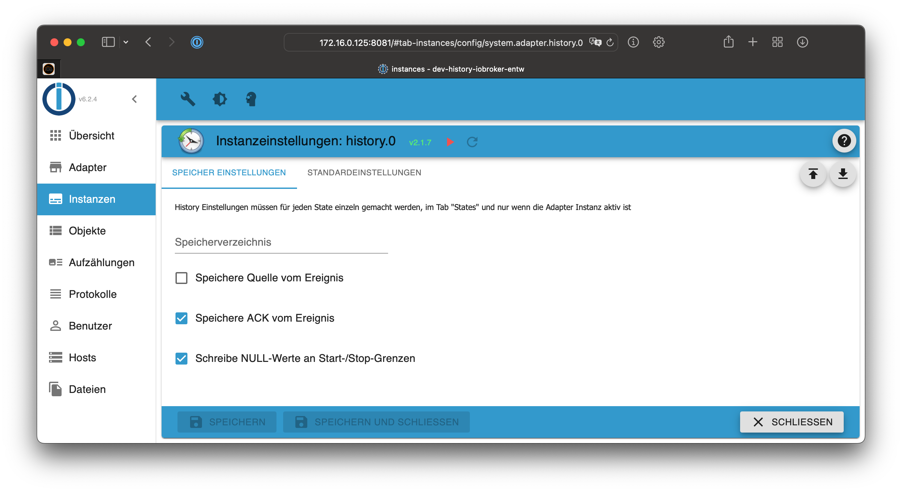
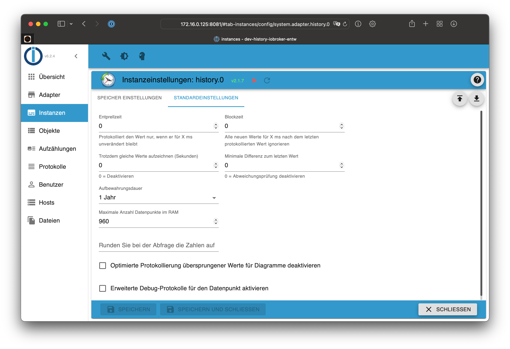
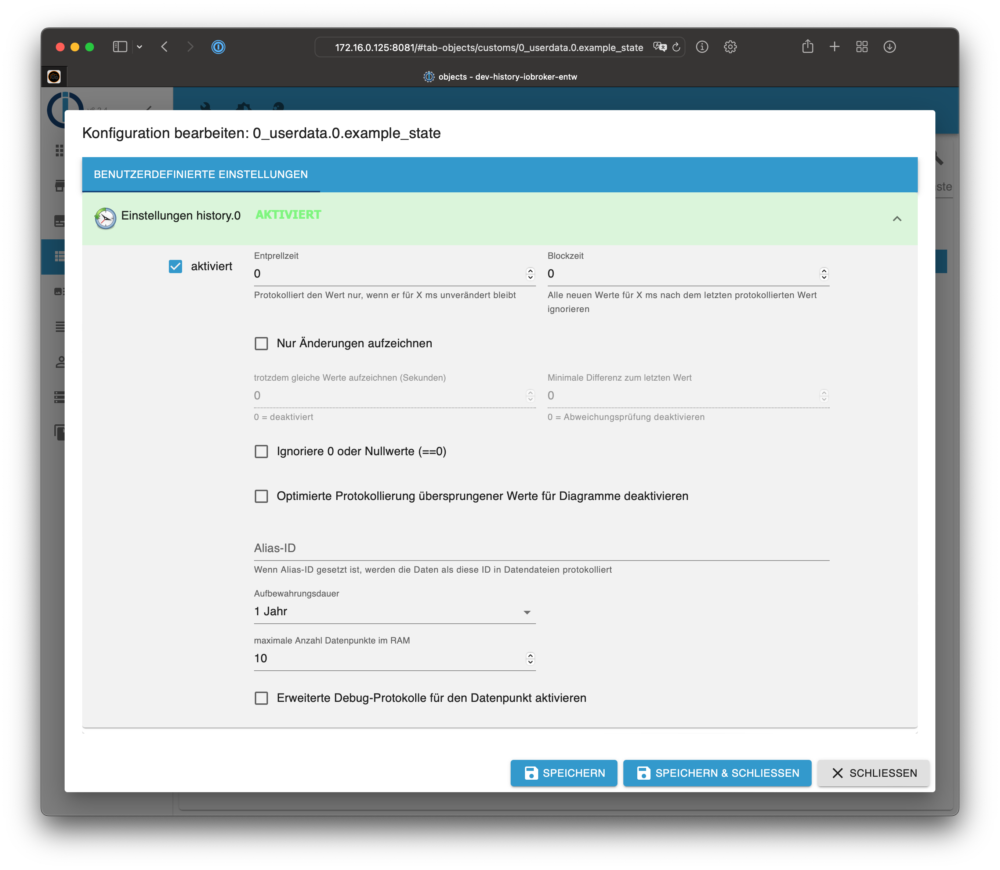
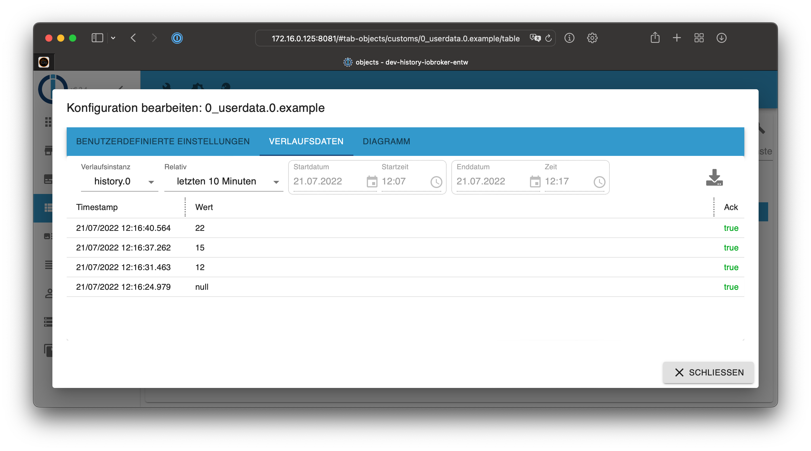
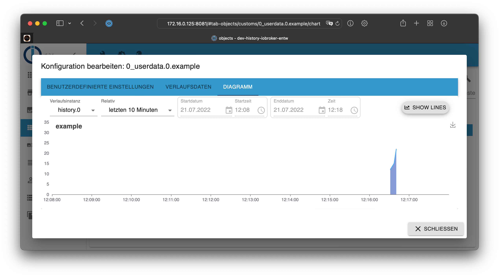
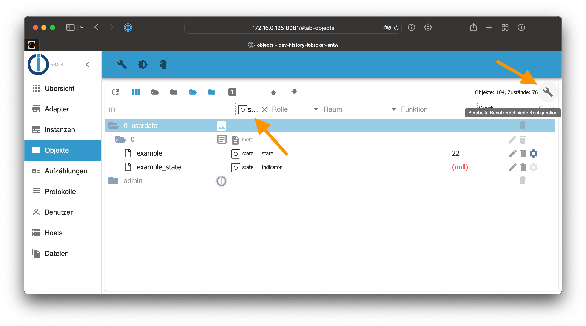

# ioBroker.history

* [Beschreibung](#beschreibung)
* [Konfiguration](#adapter-konfiguration)
	* [Speicher-Einstellungen](#speicher-einstellungen)
	* [Standardeinstellungen für Zustände](#standardeinstellungen-für-zustände)
	* [Einstellungen für Datenpunkte](#einstellungen-für-datenpunkte)
* [Bedienung](#bedienung)
	* [Verlaufsdaten](#verlaufsdaten)
	* [Diagramm](#diagramm)
	* [Mehrere Datenpunkte auf einmal loggen](#mehrere-datenpunkte-auf-einmal-loggen)
* [Zugriff auf History Werte mit JavaScript](#zugriff-auf-history-werte-mit-javascript)
* [Verlaufsprotokollierung über JavaScript](#verlaufsprotokollierung-über-javascript)
* [Liste aktivierter Datenpunkte aufrufen](#liste-aktivierter-datenpunkte-aufrufen)
* [History-Daten in SQL oder InfluxDB übernehmen](#history-daten-in-sql-oder-influxdb-übernehmen)

## Beschreibung

Der history-Adapter dient zum loggen von Datenpunkten, deren Statusverlauf im
JSON Format in zwei Schritten gespeichert wird

1. Zuerst werden die Werte im RAM zwischengespeichert
2. beim Erreichen der maximalen Anzahl von Werten im RAM in das ausgewählte Speicherverzeichnis geschrieben

## Adapter-Konfiguration

### Speicher-Einstellungen



**Speicherverzeichnis**

Hier den Ordnernamen eingeben, in dem die Dateien gespeichert werden sollen.

Der Ordner wird relativ zum Standardverzeichnis `/opt/iobroker/iobroker-data` angelegt.  

In diesem Ordner wird jeden Tag ein neuer Unterordner erstellt in dem die geloggten 
Daten gespeichert werden.

> Ohne Angabe eines Speicherverzeichnisses wird der Ordner `/opt/iobroker/iobroker-data/history`
automatisch angelegt

> Absolute Verzeichnisse wie z.B.: `/mnt/history` (Linux) oder `D:/history` (Windows) können
ebenso eingegeben werden

> Daten dürfen niemals in einem `node_modules` Verzeichnis gespeichert werden!

**Speichere Quelle vom Ereignis**
Legt fest, ob die Quelle der Datenänderung (der auslösende Adapter) mit gespeichert
werden soll.

**Speichere ACK vom Ereignis**
Legt fest, ob das "Ack-Flag" mit gespeichert werden soll.

**Schreibe NULL-Werte an Start-/Stop-Grenzen**
??

### Standardeinstellungen für Zustände

Hiermit werden Voreinstellungen für die zu überwachenden Datenpunkte festgelegt.
Jeder Wert kann im Datenpunkt selbst nachträglich angepasst werden.



**Entprellzeit**
Protokolliert den Wert nur, wenn er für X Millisekunden unverändert bleibt. Dient zum Schutz
vor zu häufigen Änderungen eines Wertes.

**Blockzeit**
Alle neuen Werte für X ms nach dem letzten protokollierten Wert ignorieren.

**Trotzdem gleiche Werte aufzeichnen (Sekunden)**
Sollen bei gleichem Wert von Zeit zu Zeit trotzdem diese (unveränderten) Werte
gespeichert werden, kann hier eine Zeitspanne in Sekunden festgelegt werden,
wie häufig dieses geschehen soll. Wert 0 bedeutet, dass kein doppelter Wert
gespeichert werden soll.

**Minimale Differenz zum letzten Wert**
Sollen bei ständig wechselnden Werten trotzdem diese (geänderten) Werte nicht
gespeichert werden, kann hier ein Mindestwert festgelegt werden, den sich der Wert
ändern muss, damit wieder ein neuer Wert gespeichert wird. Dies ist beispielsweise
bei Strommesssteckdosen sinnvoll, bei dem nicht jede leichte Veränderung geloggt
werden soll. Wert 0 bedeutet, dass jeder Wert gespeichert werden soll.

**Aufbewahrungsdauer**
Legt fest, wie lange die Werte gespeichert werden sollen. Nach der eingestellten
Zeit werden sie gelöscht (keine automatische Löschung, 2 Jahre, 1 Jahre, …, 1 Tag).

**Maximale Anzahl Datenpunkte im RAM**
Nach dem Erreichen dieser Anzahl werden die Werte vom RAM ins Speicherverzeichnis
geschrieben. **Besonders bei Systemen mit SD-Karte, kann ein hoher Wert die Lebensdauer
der SD-Karte erhöhen.**

**Runden Sie bei der Abfrage die Zahlen auf**
Legt fest, auf wieviele Nachkommastellen die Werte gerundet werden sollen, wenn diese aus
der Datenbank abgefragt werden.

**Optimierte Protokollierung übersprungener Werte für Diagramme deaktivieren**
??

**Erweiterte Debug-Protokolle für den Datenpunkt aktivieren**
Kann zur Fehlersuche genutzt werden, um mehr Informationen für einzelne Datenpunkte zu
erhalten. Damit die Log-Meldungen sichtbar werden muss das Log-Level des Adapters auf
"debug" gestellt werden!

## Einstellungen für Datenpunkte

Die Einstellungen für den zu loggenden Datenpunkt werden in dem Tab „Objekte“
bei dem entsprechenden Datenpunkt in der Spalte rechts über das Zahnradsymbol durchgeführt.


Das Konfigurationsmenü öffnet sich:



**Aktiviert**
Logging des Datenpunktes aktivieren

**Entprellzeit**
Protokolliert den Wert nur, wenn er für X ms unverändert bleibt. Dient zum Schutz
vor zu häufigen Änderungen eines Wertes.

**Blockzeit**
Alle neuen Werte für X ms nach dem letzten protokollierten Wert ignorieren.

**Nur Änderungen aufzeichnen**
Es werden nur Werte gespeichert, wenn sich der Wert des Datenpunktes ändert und
spart somit Speicherplatz. Alle weiteren Einstellungen sind gemäß den Standard-
einstellungen für Zustände voreingestellt und können hier nochmals angepasst werden.

**Trotzdem gleiche Werte aufzeichnen (Sekunden)**
Sollen bei gleichem Wert von Zeit zu Zeit trotzdem diese (unveränderten) Werte
gespeichert werden, kann hier eine Zeitspanne in Sekunden festgelegt werden,
wie häufig dieses geschehen soll. Wert 0 bedeutet, dass kein doppelter Wert
gespeichert werden soll.

**Minimale Differenz zum letzten Wert**
Sollen bei ständig wechselnden Werten trotzdem diese (geänderten) Werte nicht
gespeichert werden, kann hier ein Mindestwert festgelegt werden, den sich der Wert
ändern muss, damit wieder ein neuer Wert gespeichert wird. Dies ist beispielsweise
bei Strommesssteckdosen sinnvoll, bei dem nicht jede leichte Veränderung geloggt
werden soll. Wert 0 bedeutet, dass jeder Wert gespeichert werden soll.


**Ignoriere 0 oder Nullwerte (==0)**
Mit dieser Option kann vermieden werden, dass die Werte `0` oder `null` in die
Datenbank gespeichert werden

**Optimierte Protokollierung übersprungener Werte für Diagramme deaktivieren**
??

**Alias-ID**
Wenn Alias-ID gesetzt ist, werden die Daten mit dieser ID in Datenbank protokolliert.
Dies kann nützlich sein, falls sich eine Objekt-ID geändert hat (z.B. Gerät ausgetauscht)
und die Protokollierung unter der alten ID weiterhin stattfinden soll.

**Aufbewahrungsdauer**
Legt fest, wie lange die Werte gespeichert werden sollen. Nach der eingestellten
Zeit werden sie gelöscht (keine automatische Löschung, 2 Jahre, 1 Jahre, …, 1 Tag).

**Maximale Anzahl Datenpunkte im RAM**
Nach dem Erreichen dieser Anzahl werden die Werte vom RAM ins Speicherverzeichnis
geschrieben. **Besonders bei Systemen mit SD-Karte, kann ein hoher Wert die Lebensdauer
der SD-Karte erhöhen.**

**Runden Sie bei der Abfrage die Zahlen auf**
Legt fest, auf wieviele Nachkommastellen die Werte gerundet werden sollen, wenn diese aus
der Datenbank abgefragt werden.

**Erweiterte Debug-Protokolle für den Datenpunkt aktivieren**
Kann zur Fehlersuche genutzt werden, um mehr Informationen für einzelne Datenpunkte zu
erhalten. Damit die Log-Meldungen sichtbar werden muss das Log-Level des Adapters auf
"debug" gestellt werden!

## Bedienung

### Verlaufsdaten

Ein Klick auf das Zahnradsymbol im Datenpunkt des Objektes öffnet die
Einstellungen. Unter "Verlaufsdaten" erscheinen die bereits geloggten Daten:



### Diagramm

Bei numerischen Datenpunkten kann außerdem unter "Diagramm" eine Graph dargestellt werden.



### Mehrere Datenpunkte auf einmal loggen

Um mehrere Datenpunkte auf einmal zu loggen, lassen sich über Filterfelder in der
Titelzeile die Datenpunkte so filtern, dass man z.B. nur die Datenpunkte vom Typ
"state" herausfiltert, um sie dann gemeinsam alle zu loggen.

> Vorsicht: Bei großen Installationen kann es viele tausend Datenpunkte vom Typ "state"
geben. Das erstellen dauert entsprechend lange! Das beschriebene Vorgehen dient
nur als Beispiel!

1. In Objekt-Tab in die Listenansicht wechseln
2. Den Filterbegriff "state" in der Spalte Typ auswählen
3. Klicke auf den Gabelschlüssel oben rechts um die Log-Einstellungen zu öffnen
4. Das loggen für alle gefilterten Datenpunkte auf einmal aktivieren
5. Weitere Parameter wie „Nur Änderungen aufzeichnen“ auswählen
6. Die Änderungen speichern



## Zugriff auf History Werte mit JavaScript

Mit installiertem JavaScript-Adapter kann auf die Werte des Adapters
zugegriffen werden. Beispiele:

- Die 50 zuletzt gespeicherte Ereignisse für alle IDs holen:

```javascript
sendTo('history.0', 'getHistory', {
    id: '*',
    options: {
        end:       Date.now(),
        count:     50,
        aggregate: 'onchange',
        addId:     true
    }
}, function (result) {
    for (var i = 0; i < result.result.length; i++) {
        console.log(result.result[i].id + ' ' + new Date(result.result[i].ts).toISOString());
    }
});
```

- Abrufen der in der letzten Stunde gespeicherten Werte für Datenpunkt `system.adapter.admin.0.memRss`

```javascript
var end = Date.now();
sendTo('history.0', 'getHistory', {
    id: 'system.adapter.admin.0.memRss',
    options: {
        start:      end - 3600000,
        end:        end,
        aggregate: 'onchange'
    }
}, function (result) {
    for (var i = 0; i < result.result.length; i++) {
        console.log(result.result[i].val + ' ' + new Date(result.result[i].ts).toISOString());
    }
});
```

Verfügbare Optionen:

- `start` - (optional) Zeit in ms - `Date.now()`
- `end` - (optional) Zeit in ms - `Date.now()`, Standarwert (jetzt + 5.000 s)
- `step` - (optional) Nutzung bei Aggregation (m4, max, min, average, total) Schritte in ms Intervall
- `count` - Anzahl der Werte, wenn das Aggregat 'onchange' ist, oder wenn eine andere Aggregatmethode verwendet wird Anzahl der Intervalle. `Count` wird ignoriert, wenn `step` gesetzt ist, sonst ist der Default-Wert 500 wenn count nicht angegeben.
- `from` - wenn `from` Feld in Antwort enthalten sein soll
- `ack` - wenn `ack` Feld in Antwort enthalten sein soll
- `q` - wenn `q` Feld in Antwort enthalten sein soll
- `addId` - wenn `id` Feld in Antwort enthalten sein soll
- `limit` - limitiert die Anzahl der zurückgegebenen Einträge
- `round` - Rundet das Ergebnis auf die definierte Anzahl Nachkommastellen
- `ignoreNull` - wenn Nullwerte enthalten sein sollen (false), ersetzt durch den letzten Nicht-Nullwert (true) oder ersetzt durch 0 (0)
- `removeBorderValues` - Im Standard werden Grenzwerte zurückgegeben, um Diagramme zu optimieren. Diese Option kann genutzt werden, um das Verhalten zu deaktivieren
- `returnNewestEntries` - Die zurückgegebenen Daten werden immer aufsteigend nach Datum zurückgegeben. Falls aggregate `none` zusammen mit `count` oder `limit` genutzt wird, werden normalerweise nur die ältesten Einträge zurückgegeben (falls kein "start" übergeben wurde). Mit dieser Option werden stattdessen die neuesten Einträge zurückgegeben.
- `aggregate` - Aggregations Methoden:
    - `minmax` - verwendet speziellen Algorithmus. Verbindet den gesamten Zeitbereich in kleinen Intervallen und finde für jedes Intervall Max-, Min-, Start- und Endwerte.
    - `max` - Verbinde den gesamten Zeitbereich in kleinen Intervallen und finde für jedes Intervall den Maximalwert und verwende ihn für dieses Intervall (Nullen werden ignoriert).
    - `min` - Wie `max`, aber mit minimalem Wert.
    - `average` - Wie `max`, aber mit Durchschnittswert
    - `total` - Wie `max`, aber Gesamtwert wird berechnet.
    - `count` - Entspricht `max`, berechnet aber die Anzahl der Werte (Nullen werden berechnet).
    - `percentile` - 
    - `quantile` - 
    - `integral` - 
    - `none` - Überhaupt keine Aggregation. Nur Rohwerte im angegebenen Zeitraum.
- `percentile` - 
- `quantile` - 
- `integralUnit` - 
- `integralInterpolation` - 
    - `linear` - 
    - `none` - 
- `integralTotal` - Berechnet den Integral über dem gesamten Zeitintervall und liefert nur einen Wert im Antwort

Der erste und der letzte Punkt werden für Aggregationen berechnet, mit Ausnahme
der Aggregation **none**. Bei manueller Anforderung einer Aggregation, sollten der
erste und letzte Wert ignoriert werden, da diese aus Werten außerhalb des Zeitraums
berechnet werden.

### storeState

Sollen andere Daten in z.B. eine InfluxDB geschrieben werden, kann die eingebaute
Systemfunktion **storeState** verwendet werden. Diese Funktion kann auch zum
Konvertieren von Daten aus anderen Verlaufsadaptern wie dem SQL-Adapter verwendet
werden.

Eine erfolgreiche Antwort heißt nicht, dass auch wirklich Daten geschrieben wurden.
Es bedeutet nur, dass die Daten erfolgreich verarbeitet wurden!

Die Nachricht kann eines der folgenden drei Formate haben:

- eine ID und ein Objektstatus
- eine ID und ein Array von Objektstatus
- Array von mehreren IDs mit Objektstatus

```javascript
sendTo('history.0', 'storeState', [
    id: 'mbus.0.counter.xxx',
    state: {ts: 1589458809352, val: 123, ack: false, from: 'system.adapter.whatever.0', ...}
], result => console.log('added'));

sendTo('history.0', 'storeState', {
    id: 'mbus.0.counter.xxx',
    state: [
      {ts: 1589458809352, val: 123, ack: false, from: 'system.adapter.whatever.0', ...}, 
      {ts: 1589458809353, val: 123, ack: false, from: 'system.adapter.whatever.0', ...}
    ]
}, result => console.log('added'));

sendTo('history.0', 'storeState', [
    {id: 'mbus.0.counter.xxx', state: {ts: 1589458809352, val: 123, ack: false, from: 'system.adapter.whatever.0', ...}}, 
    {id: 'mbus.0.counter.yyy', state: {ts: 1589458809353, val: 123, ack: false, from: 'system.adapter.whatever.0', ...}}
], result => console.log('added'));
```

Zusätzlich kann das Attribut `rules: true` verwendet werden, um alle definierten Regeln auf dem Objekt zu aktivieren (z.B. `counter`, `changesOnly`, `de-bounce`, usw.).

### Daten löschen

Um einzelne Einträge aus der Datenbank zu löschen, kann **delete** verwedet werden:

```javascript
sendTo('history.0', 'delete', [
    {id: 'mbus.0.counter.xxx', state: {ts: 1589458809352}, 
    {id: 'mbus.0.counter.yyy', state: {ts: 1589458809353}
], result => console.log('deleted'));
```

Um ALLE Verlaufsdaten für einen Datenpunkt zu löschen, ist **deleteAll** zu verwenden:

```javascript
sendTo('history.0', 'deleteAll', [
    {id: 'mbus.0.counter.xxx'} 
    {id: 'mbus.0.counter.yyy'}
], result => console.log('deleted'));
``` 

Um einen Bereich der Verlaufsdaten für einen Datenpunkt zu löschen, kann **deleteRange** verwendet werden:

```javascript
sendTo('history.0', 'deleteRange', [
    {id: 'mbus.0.counter.xxx', start: '2019-01-01T00:00:00.000Z', end: '2019-12-31T23:59:59.999'}, 
    {id: 'mbus.0.counter.yyy', start: 1589458809352, end: 1589458809353}
], result => console.log('deleted'));
``` 

Die Zeit könnte ms seit Epoche oder eine Zeichenfolge sein, die durch das Javascript-Datumsobjekt konvertiert werden könnte.

Werte werden **inklusive definierter Grenzen** gelöscht (`ts >= start AND ts <= end`).

### Daten aktualisieren

Wenn Sie den Wert, die Qualität oder das Acknowledge-Flag in der Datenbank ändern möchten, können Sie die eingebaute Systemfunktion **update** verwenden:

```javascript
sendTo('history.0', 'update', [
    {id: 'mbus.0.counter.xxx', state: {ts: 1589458809352, val: 15, ack: true, q: 0}, 
    {id: 'mbus.0.counter.yyy', state: {ts: 1589458809353, val: 16, ack: true, q: 0}
], result => console.log('deleted'));
```

`ts` ist obligatorisch. Mindestens ein weiteres Flag muss im Zustandsobjekt enthalten sein.

## Verlaufsprotokollierung über JavaScript

Der Adapter unterstützt das Aktivieren/Deaktivieren der Verlaufsprotokollierung
über JavaScript sowie das Abrufen der Liste aktivierter Datenpunkte mit
ihren Einstellungen.

### Aktivieren

Es wird die `id` des Datenpunkts benötigt und optional `options` zum Definieren
von Datenpunkt-spezifischen Einstellungen:

```javascript
sendTo('history.0', 'enableHistory', {
    id: 'system.adapter.history.0.memRss',
    options: {
        changesOnly:  true,
        debounce:     0,
        retention:    31536000,
        maxLength:    3,
        changesMinDelta: 0.5,
        aliasId: ''
    }
}, function (result) {
    if (result.error) {
        console.log(result.error);
    }
    if (result.success) {
        //successfull enabled
    }
});
```

### Deaktivieren

Es wird die `id` des Datenpunkts benötigt.

```javascript
sendTo('history.0', 'disableHistory', {
    id: 'system.adapter.history.0.memRss',
}, function (result) {
    if (result.error) {
        console.log(result.error);
    }
    if (result.success) {
        //successfull enabled
    }
});
```

## Liste aktivierter Datenpunkte aufrufen

Es werden keine Parameter benötigt.

```javascript
sendTo('history.0', 'getEnabledDPs', {}, function (result) {
    // result ist ein Objekt. Beispiel:
    {
        "system.adapter.history.0.memRss": {
            changesOnly: true,
            debounce: 0,
            retention: 31536000,
            maxLength: 3,
            changesMinDelta: 0.5,
            enabled: true,
            changesRelogInterval: 0,
            aliasId: ""
        }
    }
});
```

## History-Daten in SQL oder InfluxDB übernehmen

Wenn im Laufe der Zeit viele Daten anfallen, ist der History-Adapter möglicherweise
nicht die beste Wahl und es wäre besser eine echte Datenbank zu nutzen. Da es ioBroker-
Adapter für SQL-Datenbanken (PostgreSQL, MS-SQL, MySQL, SQLite) und für InfluxDB
gibt, wäre es sinnvoll bereits gesammelte Daten des History-Adapters in die neue
Zieldatenbank übernehmen zu können.

Diese Aufgabe wird von Skripts im Linux Verzeichnis `/opt/iobroker/node_modules/iobroker.history/converter`
erledigt. Die Ausführung erfolgt dort über die Kommandozeile mit vorangesetzten
Befehl `node`.

### Empfohlene Vorgehensweise bei der Migration

Zur Migration wird folgender Ablauf empfohlen:

1. Zuerst die neue Logging Methode aktivieren und alle Datenpunkte richtig konfigurieren. Prüfen, dass alle Werte ankommen wie geplant. Logging erfolgt "doppelt" (in History und im neuen Ziel).
2. Analyse-Skripte laufen lassen um den exakten Bereich zu ermitteln, welcher migriert werden soll.
3. History Adapter stoppen un die Migration ausführen. Dies kann etwas dauern. Die alten Werte werden hinzugefügt.
4. Wenn alles passt (und die Logfiles ausgewertet sind): History Daten löschen und Adapter deaktivieren.

### Schritt 1: Aufbereiten und analysieren von vorhandenen Daten

Beim Konvertieren von Daten sollten nur die Daten übertragen werden, die noch nicht
in der Zieldatenbank vorhanden sind. Dafür werden je nach gewünschter **Zieldatenbank**
die Skripte **analyzeinflux.js** oder **analyzesql.js** genutzt. Hiermit wird zu
Beginn einer Datenübernahme geprüft, welche Daten bereits vorhanden sind, um diese
lokal in .json Dateien zu speichern. Die .json Dateien werden dann vom eigentlichen
Konverter **history2db.js** Skript verwendet.

Folgende .json Dateien werden erstellt:

- **frühester Wert für Datenpunkt-ID** Der Zeitstempel des allerersten Eintrags für
 jeden vorhandenen Datenpunkt wird gespeichert und beim Importieren verwendet,
 um standardmäßig alle neueren Werte zu ignorieren. Es wird davon ausgegangen,
 dass die Daten ab diesem ersten Eintrag vollständig ausgefüllt sind und alle früheren
 Werte ansonsten dupliziert würden. Diese Annahme kann beim Import durch Parameter
 überschrieben werden.

- **vorhandene Werte pro Tag pro Datenpunkt-ID** Die vorhandenen Daten werden pro Tag
 analysiert und an jedem Tag, an dem bereits Daten vorhanden sind, gespeichert. Dies
 kann alternativ zu den ersten Daten verwendet werden, um auch "Löcher" in die Daten
 füllen zu können.

#### analyzeinflux.js

Dieses Skript sammelt die oben genannten Daten für eine InfluxDB-Instanz.

**Verwendung**:

`node analyzeinflux.js [InfluxDB-Instanz] [Loglevel] [--deepAnalyze]`

**Beispiel**:

`node analyzeinflux.js influxdb.0 info --deepAnalyze`

Parameter:

- Welche InfluxDB-Instanz soll verwendet werden? (Standard: influxdb.0) Wenn benutzt, muss dies der erste Parameter nach dem Skriptnamen sein.
- Loglevel für die Ausgabe (Standard: info). Wenn gesetzt, muss dies der zweite Parameter nach dem Skriptnamen sein.
- `--deepAnalyze` sammelt auch die vorhandenen Werte pro Tag, standardmäßig wird nur der früheste Wert abgefragt.

Das Skript generiert dann eine oder drei .json-Dateien mit den gesammelten Daten.
Diese Dateien werden dann vom eigentlichen Konverter Skript verwendet.

#### analyzesql.js

Dieses Skript sammelt Teile der oben genannten Daten für eine SQL-Instanz.

**Verwendung**:

`node analyzesql.js [SQL-Instanz] [Loglevel]`

**Beispiel**:

`node analyzesql.js sql.0 info`

Parameter:

- Welche SQL-Adapter-Instanz soll verwendet werden? (Standard: sql.0) Wenn benutzt, muss dies der erste Parameter nach dem Skriptnamen sein.
- Loglevel für die Ausgabe (Standard: info). Wenn gesetzt, muss dies der zweite Parameter nach dem Skriptnamen sein.

Das Skript generiert dann zwei .json-Dateien mit den gesammelten Daten. Diese
Dateien werden dann vom eigentlichen Konverter Skript verwendet.

### Schritt 2: History-Daten konvertieren

Das Skript **history2db.js** verwendet die in Schritt 1 generierten .json Dateien
um sie in die Zieldatenbank zu konvertieren. Dabei werden die generierten Dateien
untersucht um nur nicht bereits vorhandene Daten zu konvertieren.

Das Skript kann auch ohne vorherigen Analyseschritt 1 ausgeführt werden. Dann müssen
jedoch die Startdaten [Date-to-start] als Parameter festgelegt werden und alle vor
diesem Zeitpunkt liegende Daten werden konvertiert.

Wenn zuvor eine Analyse ausgeführt wurde und die Datei **earliestDBValues.json**
vorhanden ist, werden nur diese Datenpunkte konvertiert, außer es werden Parameter
verwendet, um dies abzuändern.

Wenn zuvor eine Analyse ausgeführt wurde und die Datendateien wurden verwendet,
werden diese auch mit allen konvertierten Daten aktualisiert, sodass bei einer
zweiten Ausführung normalerweise keine Duplikate generiert werden sollten.

Um die Daten zurückzusetzen, sind die Dateien **earliestDBValues.json**, **existingDBValues.json**
und/oder **existingDBTypes.json** zu löschen.

Der Konverter durchläuft dann alle als Daten verfügbaren Tage in der Zeit rückwärts und
bestimmt, welche Daten an InfluxDB übertragen werden sollen.

> Der Vorgang kann mit "x" oder "Strg-C" abgebrochen werden.

Das Konverter Skript selbst sollte mit allen Verlaufs-Adaptern funktionieren, welche die
**storeState** Methode unterstützen.

> Hinweis: Die Migration vieler Daten führt zu einer bestimmten Systemlast, insbesondere
> wenn Konverter und Zieldatenbankinstanz auf demselben Computer ausgeführt werden.
> Die Auslastung und Leistung des Systems während der Aktion sollte überwacht werden
> und möglicherweise der Parameter `delayMultiplicator` verwendet werden, um ein
> verzögertes Abarbeiten der Daten zu nutzen.

**Verwendung:**

`node history2db.js [DB-Instanz] [Loglevel] [Date-to-start|0] [path-to-Data] [delayMultiplicator] [--logChangesOnly [relog-Interval(m)]] [--ignoreExistingDBValues] [--processNonExistingValuesOnly] [--processAllDPs] [--simulate]`

**Beispiel**:

`node history2db.js influxdb.0 info 20161001 /path/to/data 2 --logChangesOnly 30 --processNonExistingValuesOnly`

Mögliche Optionen und Parameter:

- **DB-Instanz**: Instanz an die die Daten gesendet werden. Erforderlicher Parameter. Muss direkt nach dem Skriptnamen angegeben werden sein.
- **Loglevel**: Loglevel für die Ausgabe (Default: info). Wenn gesetzt, muss dies der zweite Parameter nach dem Skriptnamen stehen.
- **Date-to-start**: Startdatum im Format yyyymmdd (z. B. 20191028). "0" verwenden um erkannte früheste Werte zu verwenden. Wenn gesetzt, muss dies der dritte Parameter nach dem Skriptnamen sein.
- **path-to-Data** Pfad zu den Datendateien. Standard iobroker-Installationsverzeichnis: /iobroker-data/history-data. Wenn gesetzt, muss dies der vierte Parameter nach dem Skriptnamen sein.
- **delayMultiplicator**: Ändert die Verzögerungen zwischen den Aktionen im Skript durch einen Multiplikator. "2" würde bedeuten, dass sich die Verzögerungen verdoppeln, die der Konverter berechnet hat. Wenn gesetzt, muss dies der fünfte Parameter nach dem Skriptnamen sein.
- **--logChangesOnly [relog-Interval (m)]** Wenn gesetzt, werden die Daten analysiert und reduziert, so dass nur geänderte Werte in InfluxDB gespeichert werden. Zusätzlich kann ein "relog-Interval" in Minuten eingestellt werden, um unveränderte Werte nach diesem Intervall neu zu protokollieren.
- **--ignoreExistingDBValues**: Mit diesem Parameter werden bereits vorhandene Daten ignoriert und alle Daten in den DB eingefügt. Bitte sicherstellen, dass keine Duplikate generiert werden. Diese Option ist nützlich, um unvollständige Daten zu vervollständigen. Standardmäßig werden nur alle Datenpunkte mit mindestens einem Eintrag in der Datenbank gefüllt. Dies kann von **--processAllDPs** überschrieben werden
- **--processNonExistingValuesOnly**: Mit diesem Parameter wird die Datei **existingDBValues.json** aus dem Analyseskript verwendet und für jeden Tag und Datenpunkt geprüft. In diesem Modus werden die vorhandenen Werte in der DB immer ignoriert und auch nicht aktualisiert. **Nach Verwendung dieses Modus bitte einen weiteren Analyselauf durchführen!!!**
- **--processAllDPs** Mit diesem Parameter wird sicher gestellt, dass alle vorhandenen Datenpunkte aus
 den History-Dateien in die DB übertragen werden, auch wenn diese in der DB noch nicht vorhanden sind.
- **--simulate**: Aktiviert den Simulationsmodus, d.h. es findet kein richtiges Schreiben statt und auch die
 Analysedatendateien werden beim Beenden nicht aktualisiert.
