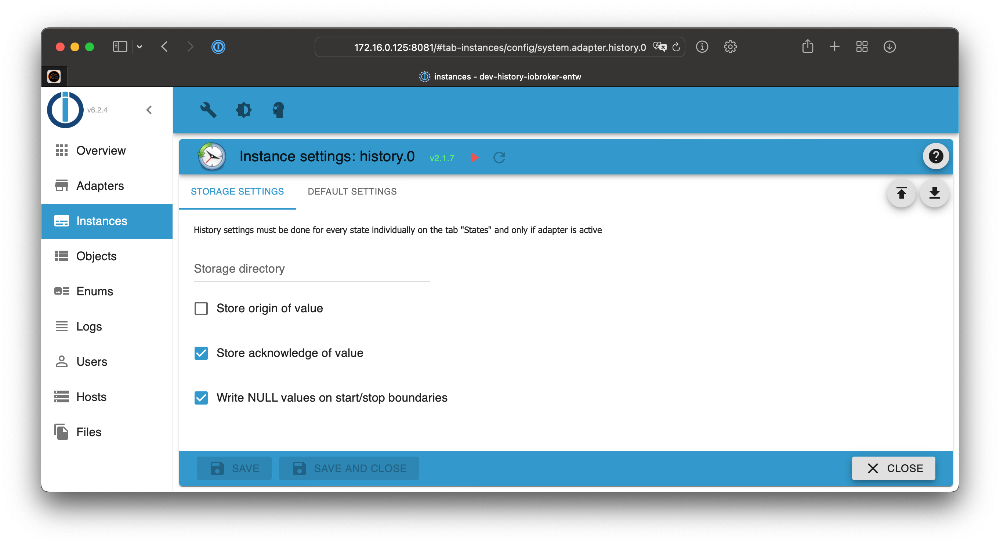
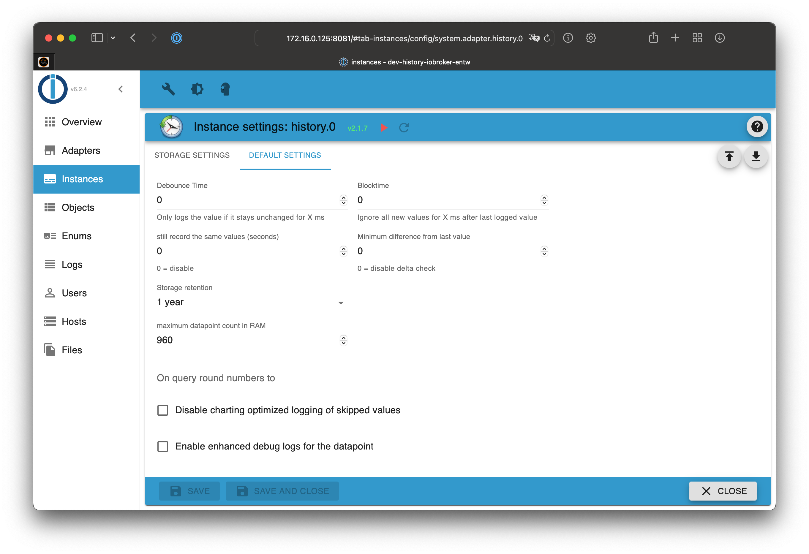
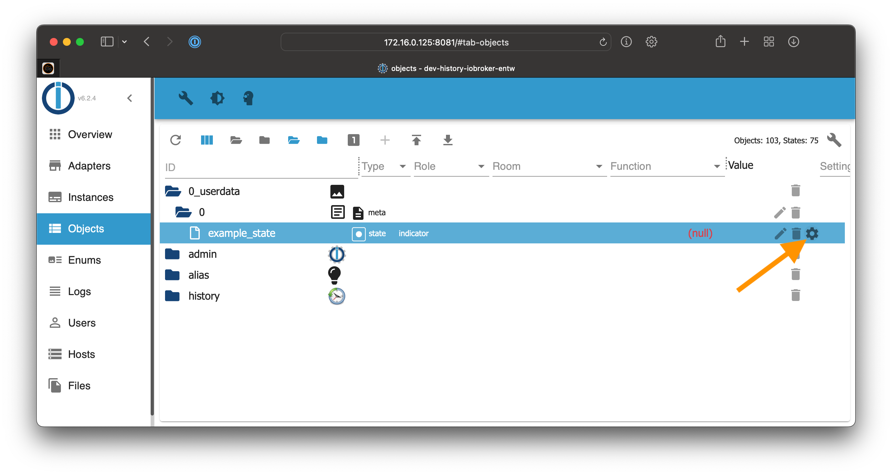
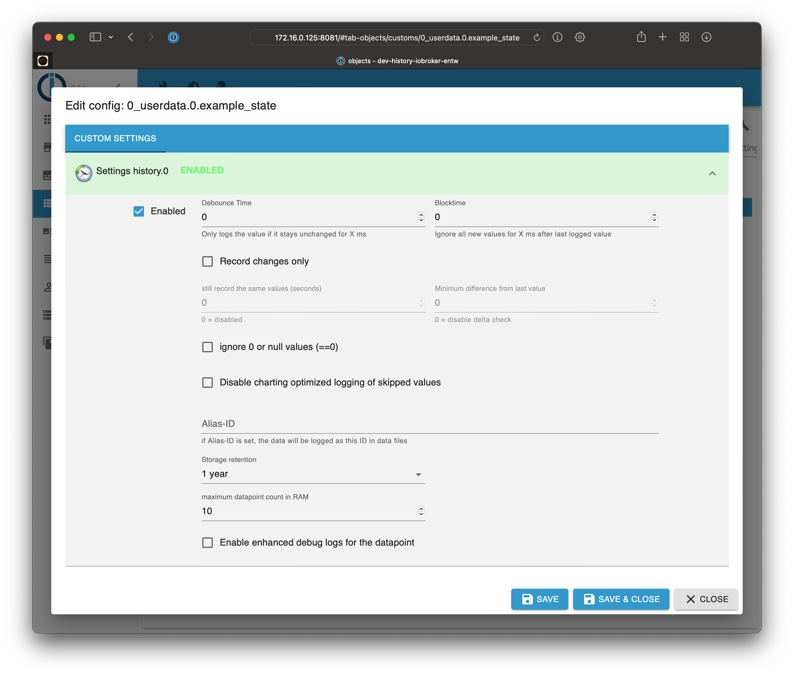
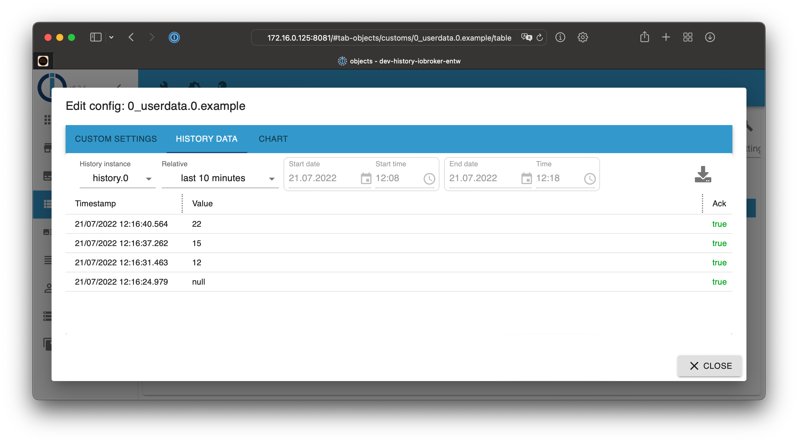
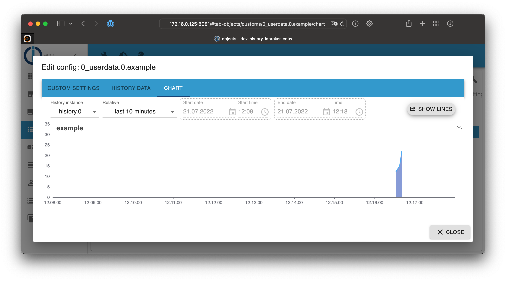
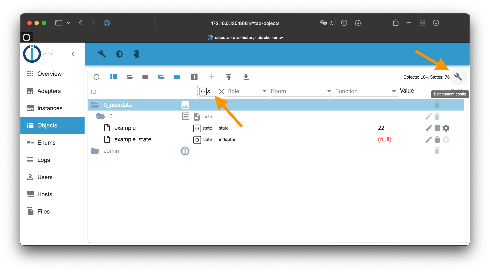

# ioBroker.history

* [Description](#description)
* [Adapter configuration](#adapter-configuration)
	* [Storage-Settings](#storage-settings)
	* [Default settings for states](#default-settings-for-states)
	* [Settings for States](#settings-for-states)
* [Usage](#usage)
	* [History data](#history-Data)
	* [Chart](#chart)
	* [Enable logging for multiple states at once](#enable-logging-for-multiple-states-at-once)
* [Access values from Javascript adapter](#access-values-from-javascript-adapter)
* [History logging management via Javascript](#history-logging-management-via-javascript)
* [Get list of enabled states](#get-list-of-enabled-states)
* [Migrate history data to SQL or InfluxDB](#migrate-history-data-to-sql-or-influxdb)

## Description

This adapter saves state history in a two-staged process.

1. At first data points are stored in RAM
2. as soon as they reach maxLength they will be stored on disk

## Adapter configuration

### Storage-Settings



**Storage directory**
Path to the directory, where the files will be stored.

The directory will be created relative to the default directory ``/opt/iobroker/iobroker-data``.

This directory will contain a new subdirectory for every new day, which contains the logged information.

> Without a path definition, data will be stored to the default location ``/opt/iobroker/iobroker-data/history``

> Absolute paths like ``/mnt/history`` (Linux) or ``D:/History`` (Windows) are also supported

> Please DO NOT store the data in any ``node_modules`` directory!

**Store origin of value**
Defines, if the "from" attribute will be stored, too.

**Store acknowledge of value**

**Write NULL values on start/stop boundaries**

### Default settings for states

There are the default settings for every new state which should be logged.
Every value can be changed individually for each state afterwards.



**Debounce Time**
Protection against unstable values to make sure that only stable values are
logged when the value did not change in the defined amount of Milliseconds.

**Blocktime**
Defines for how long after storing the last value no further value is stored.
When the given time in Milliseconds is over then the next value that fulfills
all other checks is logged.

**Still record the same values (seconds)**
When using "Record changes only" you can set a time interval in seconds here
after which also unchanged values will be re-logged into the DB.

**Minimum difference from last value**
When using "Record changes only" you can define the required minimum difference
between the new value and the last value. If this is not reached the value is
not recorded.

**Storage retention**
How many values in the past will be stored on disk. Data is deleted when the time
is reached as soon as new data should be stored for a datapoint.

**Maximum datapoint count in RAM**
Define how many number of values will be hold in RAM before persisting them on
disk. You can control how much I/O is done. This can be useful for systems
which uses a SD card for storage to extend the life time.

**On query round numbers to**
Define how many digits should be rounded to when querying the values.

**Disable charting optimized logging of skipped values**
??

**Enable enhanced debug logs for the datapoint**
If you want to see more detailed logs for this datapoint, you can enable this option.
You still need to enable "debug" loglevel for these additional values to be visible!
This helps in debugging issues or understanding why the adapter is logging a value (or not).

## Settings for States

The settings of the states which should be logged are defined in the "objects" tab.
Use the cog symbol in the very right column to configure the logging settings.



The following dialog opens:



**Enabled**
Activate the logging of the state

**Debounce Time**
Protection against unstable values to make sure that only stable values are
logged when the value did not change in the defined amount of Milliseconds.

**Blocktime**
Defines for how long after storing the last value no further value is stored.
When the given time in Milliseconds is over then the next value that fulfills
all other checks is logged.

**Record changes only**
This function make sure that only changed values are logged if they fulfill other checks
(see below). Same values will not be logged.

**Still record the same values (seconds)**
When using "Record changes only" you can set a time interval in seconds here
after which also unchanged values will be re-logged into the DB.

**Minimum difference from last value**
When using "Record changes only" you can define the required minimum difference
between the new value and the last value. If this is not reached the value is
not recorded.

**Ignore values below**
Do not log values which are smaller than this value.

**Ignore values above**
Do not log values which are bigger than this value.

**Ignore 0 or null values (==0)**
This option prevents the storage of the values ``0`` or ``null`` into the database.

**Disable charting optimized logging of skipped values**
??

**Alias-ID**
You can define an alias for the ID. This is useful if you have changed a device
and want to have continuous data logging.

**Storage retention**
How many values in the past will be stored on disk. Data is deleted when the time
is reached as soon as new data should be stored for a datapoint.

**Maximum datapoint count in RAM**
Define how many number of values will be hold in RAM before persisting them on
disk. You can control how much I/O is done. This can be useful for systems
which uses a SD card for storage to extend the life time.

**On query round numbers to**
Define how many digits should be rounded to when querying the values.

**Enable enhanced debug logs for the datapoint**
If you want to see more detailed logs for this datapoint, you can enable this option.
You still need to enable "debug" loglevel for these additional values to be visible!
This helps in debugging issues or understanding why the adapter is logging a value (or not).

## Usage

### History data

A click on the cog symbol of the object opens the settings. You can find the stored history
history data in the tab "history data":



### Chart

For numeric states you can also use the "chart" tab, which will display the data as a graph.



## Enable logging for multiple states at once

To enabled logging for multiple states at once, you can filter the object list by type "state".
After that, you can enable logging for all states at once.

> Atention: Big installations can contain thousands of states. It can take a lot of time to
enable the logging for many states at once. The following process is just an example!

1. Switch to the list view in the objects tab
2. Filter for type "state"
3. Click the wrench symbol in the top right to open the configuration of log parameters
4. Enable the logging
5. Configure additional parameters like "record changes only"
6. Save the configuration



## Access values from Javascript adapter

The values can be accessed from the installed JavaScript adapter. Examples:

- Get 50 last stored events for all IDs

```javascript
sendTo('history.0', 'getHistory', {
    id: '*',
    options: {
        end:       Date.now(),
        count:     50,
        aggregate: 'onchange',
        addId:     true
    }
}, function (result) {
    for (var i = 0; i < result.result.length; i++) {
        console.log(result.result[i].id + ' ' + new Date(result.result[i].ts).toISOString());
    }
});
```

- Get stored values for ``system.adapter.admin.0.memRss`` in last hour

```javascript
var end = Date.now();
sendTo('history.0', 'getHistory', {
    id: 'system.adapter.admin.0.memRss',
    options: {
        start:      end - 3600000,
        end:        end,
        aggregate: 'onchange'
    }
}, function (result) {
    for (var i = 0; i < result.result.length; i++) {
        console.log(result.result[i].val + ' ' + new Date(result.result[i].ts).toISOString());
    }
});
```

Available options:

- **start** - (optional) time in ms - *Date.now()*'
- **end** - (optional) time in ms - *Date.now()*', by default is (now + 5000 seconds)
- **step** - (optional) used in aggregate (max, min, average, total, ...) step in ms of intervals
- **count** - number of values if aggregate is 'onchange' or number of intervals if other aggregate method. Count will be ignored if step is set, else default is 500 if not set
- **from** - if *from* field should be included in answer
- **ack** - if *ack* field should be included in answer
- **q** - if *q* field should be included in answer
- **user** - if *user* field should be included in answer
- **comment** - if *c* field should be included in answer
- **addId** - if *id* field should be included in answer
- **limit** - do not return more entries than limit
- **round** - round result to number of digits after decimal point
- **ignoreNull** - if null values should be included (false), replaced by last not null value (true) or replaced with 0 (0)
- **removeBorderValues** - By default additional border values are returned to optimize charting. Set this option to true if this is not wanted (e.g. for script data processing)
- **returnNewestEntries** - The returned data are always sorted by timestamp ascending. When using aggregate "none" and also providing "count" or "limit" this means that normally the oldest entries are returned (unless no "start" data is provided). Set this option to true to get the newest entries instead.
- **aggregate** - aggregate method (Default: 'average'):
    - *minmax* - used special algorithm. Splice the whole time range in small intervals and find for every interval max, min, start and end values.
    - *max* - Splice the whole time range in small intervals and find for every interval max value and use it for this interval (nulls will be ignored).
    - *min* - Same as max, but take minimal value.
    - *average* - Same as max, but take average value.
    - *total* - Same as max, but calculate total value.
    - *count* - Same as max, but calculate number of values (nulls will be calculated).
    - *percentile* - Calculate n-th percentile (n is given in options.percentile or defaults to 50 if not provided).
    - *quantile* - Calculate n quantile (n is given in options.quantile or defaults to 0.5 if not provided).
    - *integral* - Calculate integral (additional parameters see below).
    - *none* - No aggregation at all. Only raw values in given period.
- **percentile** - (optional) when using aggregate method "percentile" defines the percentile level (0..100)(defaults to 50)
- **quantile** - (optional) when using aggregate method "quantile" defines the quantile level (0..1)(defaults to 0.5)
- **integralUnit** - (optional) when using aggregate method "integral" defines the unit in seconds (defaults to 60s). e.g. to get integral in hours for Wh or such, set to 3600.
- **integralInterpolation** - (optional) when using aggregate method "integral" defines the interpolation method (defaults to "none").
    - *linear* - linear interpolation
    - *none* - no/stepwise interpolation 

The first and last points will be calculated for aggregations, except aggregation **none**.
If you manually request some aggregation you should ignore first and last values,
because they are calculated from values outside of period.

### storeState

If you want to write other data into the history DB you can use the build
in system function **storeState**. This function can also be used to convert
data from other History adapters like History or SQL.

A successful response do not mean that the data are really written out to
the disk. It just means that they were processed!

The given ids are not checked against the ioBroker database and do not need to be set up or enabled there. If own IDs are used without settings then the "rules" parameter is not supported and will result in an error. The default "Maximal number of stored in RAM values" is used for such IDs.

The Message can have one of the following three formats:

1. one ID and one state object
2. one ID and array of state objects
3. array of multiple IDs with one state object each

```javascript
// 1.
sendTo('history.0', 'storeState', {
    id: 'mbus.0.counter.xxx',
    state: {
        ts: 1589458809352,
        val: 123,
        ack: false,
        from: 'system.adapter.whatever.0'
    }
}, result => console.log('added'));

// 2.
sendTo('history.0', 'storeState', {
    id: 'mbus.0.counter.xxx',
    state: [
        {
            ts: 1589458809352,
            val: 123,
            ack: false,
            from: 'system.adapter.whatever.0'
        },
        {
            ts: 1589458809353,
            val: 123,
            ack: false,
            from: 'system.adapter.whatever.0'
        }
    ]
}, result => console.log('added'));

// 3.
sendTo('history.0', 'storeState', [
    {
        id: 'mbus.0.counter.xxx',
        state: {
            ts: 1589458809352,
            val: 123,
            ack: false,
            from: 'system.adapter.whatever.0'
        }
    },
    {
        id: 'mbus.0.counter.yyy',
        state: {
            ts: 1589458809353,
            val: 123,
            ack: false,
            from: 'system.adapter.whatever.0'
        }
    }
], result => console.log('added'));
```

Additionally, you can add attribute ``rules: true`` in message to activate all rules, like ``counter``, ``changesOnly``, ``de-bounce`` and so on.

### Delete states

If you want to delete entries from the database you can use the build in system function **delete**:

```javascript
sendTo('history.0', 'delete', [
    {id: 'mbus.0.counter.xxx', state: {ts: 1589458809352}, 
    {id: 'mbus.0.counter.yyy', state: {ts: 1589458809353}
], result => console.log('deleted'));
```

To delete ALL history data for some data point execute:

```javascript
sendTo('history.0', 'deleteAll', [
    {id: 'mbus.0.counter.xxx'} 
    {id: 'mbus.0.counter.yyy'}
], result => console.log('deleted'));
``` 

To delete history data for some data point and for some range, execute:

```javascript
sendTo('history.0', 'deleteRange', [
    {id: 'mbus.0.counter.xxx', start: '2019-01-01T00:00:00.000Z', end: '2019-12-31T23:59:59.999'}, 
    {id: 'mbus.0.counter.yyy', start: 1589458809352, end: 1589458809353}
], result => console.log('deleted'));
``` 

Time could be ms since epoch or ans string, that could be converted by javascript Date object.

Values will be deleted **including defined limits** (``ts >= start AND ts <= end``).

## Update states

If you want to change values, quality or acknowledge flag in the database you can use the build in system function **update**:

```javascript
sendTo('history.0', 'update', [
    {id: 'mbus.0.counter.xxx', state: {ts: 1589458809352, val: 15, ack: true, q: 0}, 
    {id: 'mbus.0.counter.yyy', state: {ts: 1589458809353, val: 16, ack: true, q: 0}
], result => console.log('deleted'));
```

``ts`` is mandatory. At least one other flags must be included in state object.

## History logging management via Javascript

The adapter supports enabling and disabling of history logging via JavaScript
and also retrieving the list of enabled data points with their settings.

### Enable

The message requires to have the ``id`` of the datapoint. Additionally,
optional ``options`` to define the datapoint specific settings:

```javascript
sendTo('history.0', 'enableHistory', {
    id: 'system.adapter.history.0.memRss',
    options: {
        changesOnly:  true,
        debounce:     0,
        retention:    31536000,
        maxLength:    3,
        changesMinDelta: 0.5,
        aliasId: ''
    }
}, function (result) {
    if (result.error) {
        console.log(result.error);
    }
    if (result.success) {
        //successfull enabled
    }
});
```

### Disable

The message requires to have the ``id`` of the datapoint.

```javascript
sendTo('history.0', 'disableHistory', {
    id: 'system.adapter.history.0.memRss',
}, function (result) {
    if (result.error) {
        console.log(result.error);
    }
    if (result.success) {
        //successfull enabled
    }
});
```

## Get list of enabled states

The message has no parameters.

```javascript
sendTo('history.0', 'getEnabledDPs', {}, function (result) {
    // result is an object. Example:
    {
        "system.adapter.history.0.memRss": {
            changesOnly: true,
            debounce: 0,
            retention: 31536000,
            maxLength: 3,
            changesMinDelta: 0.5,
            enabled: true,
            changesRelogInterval: 0,
            aliasId: ""
        }
    }
});
```

## Migrate history data to SQL or InfluxDB

### General idea

When you have more data over time then the history adapter may not be the best choice and a real database is better. For this there are more adapters for data storage. E.g. for SQL databases (PostgreSQL, MS-SQL, MySQL, SQLite) and InfluxDB.
With this change the question comes up how to convert the collected data from the past to these new adapters.

For this some converter scripts have been placed in the directory ``/opt/iobroker/node_modules/iobroker.history/converter`` that can help and do the job. These scripts are called from the command line with ``node``.

### Best practice when executing the conversion

If you move from one history method to another I propose the following process:

1. Activate the new history method (sql/influxdb) for the relevant states and start logging and check that this works as expected. This means you log "twice" (in history and the new target).
2. Run the analyze scripts to get the "cut off" points where the duplicate logging started.
3. Stop the history adapter and execute the migration (this can take some time). So the older values will be added to the new ones.
4. When you are sure you did anything and also checked the error files: Delete the history data to get some space back.

### Step 1: Prepare and analyze existing data in transfer target

When converting data only those data should be transferred that are not already
there. Therefor the first set of scripts exists called **analyze<db>.js**. This
script should be executed once at the beginning to collect some data for existing
data and store them in local .json files to be used by the real converter script.

Two kind of data are collected:

- **earliest value for datapoint ID**: The timestamp of the very first entry
for each existing datapoint is stored and is used by imported to ignore all
newer values by default. The assumption is that the data are filled completely
beginning with this first entry and all earlier values would else be duplicated.
This assumption can be overwritten on import by parameters.

- **existing values per day per datapoint ID**: The existing data are analyzed
on a per-day basis and each day is stored where data exist already. This can be
used as alternative to the first data to be able to also fill "holes" in the data.

#### analyzeinflux.js

This script collects the mentioned data for an InfluxDB instance.

**Usage**:

``node analyzeinflux.js [InfluxDB-Instance] [Loglevel] [--deepAnalyze]``

**Example**:

``node analyzeinflux.js influxdb.0 info --deepAnalyze``

Parameters:
- InfluxDB-Instance: which influxdb-Adapter instance should be used? (Default: influxdb.0) If set needs to be first parameter after script name.
- Loglevel: Loglevel for output (Default: info). If set needs to be second parameter after script name.
- ``--deepAnalyze``: collect the existing values per day too, by default only the earliest value is queried.

The script will then generate one or three .json files with the collected data. These files are then used by the real converter script.

#### analyzesql.js

This script collects the mentioned data for an SQL instance.

**Usage**:

``node analyzesql.js [SQL-Instance] [Loglevel]``

**Example**:

``node analyzesql.js sql.0 info``

Parameters:
- SQL-Instance: which SQL-Adapter instance should be used? (Default: sql.0) If set needs to be first parameter after script name.
- Loglevel: Loglevel for output (Default: info). If set needs to be second parameter after script name.

The script will then generate two .json files with the collected data. These files are then used by the real converter script.

### Convert History-Data to a DB

The script will directly use the generated JSON files from the history adapter
on disk to transfer them into the Database. Additionally, it uses the pre-generated
data files for already existing values in the target DB to only convert not existing data.

The script can be run without any analyze (step 1) beforehand then you need to set the
startdata as parameter, and it will simply convert anything from that time point backwards in time.

When you have run an analyze before and the **earliestDBValues.json** file exists then only
these data points are converted, unless you use parameters to change that.

When an analyze was run before and the datafiles are used, they are also updated with all
converted data, so a second run will normally not generate duplicates.

To reset the data delete the File **earliestDBValues.json**, **existingDBValues.json**
and/or **existingDBTypes.json**.

The Converter then goes backward in time through all the days available as data and
will determine which data to transfer to InfluxDB.

> If you want to abort the process you can press "x" or "<CTRL-C>".

The converter script itself should work with all History adapters which support the **storeState** method.

> Note: Migrating many data will produce a certain load on the system, especially
> when converter and target database instance are running on the same machine.
> Monitor your systems load and performance during the action and maybe use the
> ``delayMultiplicator`` parameter to increase delays in the converter.

**Usage:**

``node history2db.js [DB-Instanz] [Loglevel] [Date-to-start|0] [path-to-Data] [delayMultiplicator] [--logChangesOnly [relog-Interval(m)]] [--ignoreExistingDBValues] [--processNonExistingValuesOnly] [--processAllDPs] [--simulate]``

**Example**:

``node history2db.js influxdb.0 info 20161001 /path/to/data 2 --logChangesOnly 30 --processNonExistingValuesOnly``

Possible options and parameters:

- **DB-Instance**: DB-Instance to send the data to.Required parameter. Needs to be first parameter after script name.
- **Loglevel**: Loglevel for output (Default: info). If set needs to be second parameter after script name.
- **Date-to-start**: Day to start in format `yyyymmdd` (e.g. 20161028). Use "0" to use detected earliest values. If set needs to be third parameter after script name.
- **path-to-Data**: Path to the datafiles. Default to iobroker-install-directory/iobroker-data/history-data . If set needs to be fourth parameter after script name.
- **<delayMultiplicator>**: Modify the delays between several actions in the script by a multiplicator. "2" would mean that the delays the converted had calculated by itself are doubled. If set needs to be fifth parameter after script name.
- **--logChangesOnly [relog-Interval(m)]**: when --logChangesOnly is set the data are parsed and reduced, so that only changed values are stored in InfluxDB. Additionally, a "relog-Interval(s)" can be set in minutes to re-log unchanged values after this interval.
- **--ignoreExistingDBValues**: With this parameter all existing data are ignored and all data are inserted into DB. Please make sure that no duplicates are generated. This option is useful to fix "holes" in the data where some data are missing. By default, it only fills all data points with at least one entry in the DB. This can be overwritten by `--processAllDPs`
- **--processNonExistingValuesOnly**: With this parameter the "existing data points by day" file from the analyze script is used and checked for each day and datapoint. **In this mode the existing-DB-Values are always ignored, and also not updated, so please do another analyze run after using that mode!!!**
- **--processAllDPs**: With this parameter you make sure that all existing data points from the history files is transferred into the DB, also if these are not existing in that DB so far.
- **--simulate**: With this parameter you enable the simulation mode, means that no real write happens and also the analyze-datafiles will not be updated on exit.
